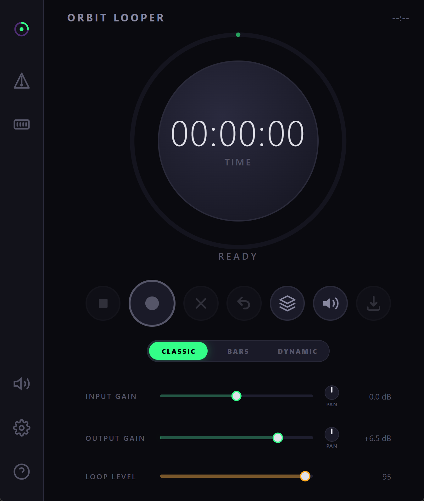
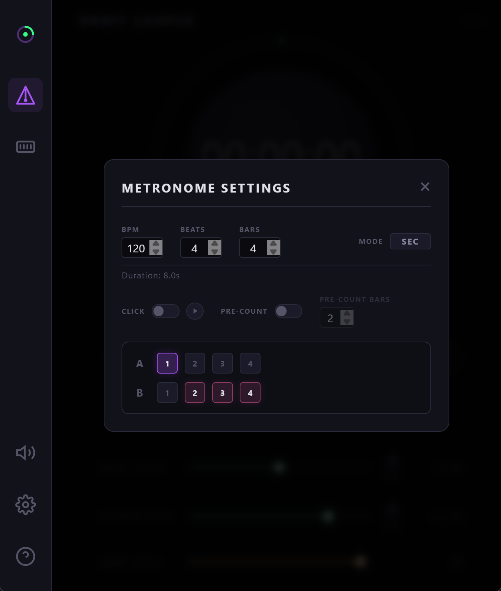
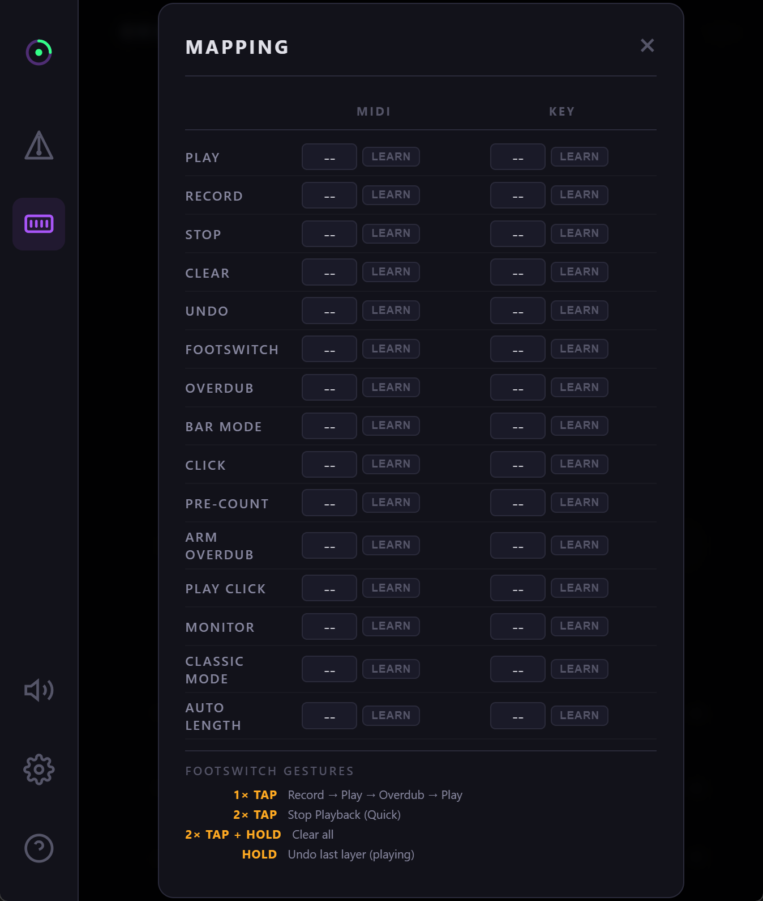

# Orbit Looper

> **🎵 Vibe-Coded Plugin** — This entire project was built with **Google Antigravity** using a combination of **Gemini 3/3.1 Pro**, **Claude 4.6 Sonnet / Opus 4.6**, and **GPT-5.3-codex**. I (the author) have no development experience — I provided the ideas and instructions, and AI wrote every line of code. This is a **vibe project** and will continue to be developed this way.
>
> **Testing Disclaimer**: I do not have access to Apple hardware or a dedicated Linux ARM64 test bench. These versions are verified via documentation research and automated CI/CD pipelines. If you encounter hardware-specific issues, please [report them](https://github.com/dev-dhg/orbit-looper/issues) or submit a PR.

---

A guitar looper audio plugin with a modern WebView UI. Record, layer, and loop with a minimal, musician-friendly interface.

<table>
  <tr>
    <td align="center" valign="top"><br/><sub>Default UI</sub></td>
    <td align="center" valign="top"><br/><sub>Metronome</sub></td>
    <td align="center" valign="top"><br/><sub>MIDI / Key Mapping</sub></td>
  </tr>
</table>


---

## Features

### Core Looper
- **Multi-Layer Overdub** — Up to 8 independent loop layers with non-destructive recording. Each layer can extend beyond the original loop length
- **Non-Destructive Undo** — Remove overdub layers one by one (up to 7 overdubs). Undo during recording cancels the active layer; undo during playback removes the most recent finalized layer.
- **Ditto-Style Footswitch** — Single CC for full looper control:
  - **1× Tap**: Record → Play → Overdub → Play (cycle)
  - **2× Tap**: Stop playback
  - **2x Tap and Hold**: Clear all
  - **Hold**: Undo last layer (playing)
- **Overdub Arm** (Default: ON) — Queue overdub to engage at the next loop boundary instead of immediately. Blue visual indicator while armed
- **WAV Export** — Export your loop mixdown as a 24-bit stereo WAV file

### Looping Modes
Orbit Looper features three distinct looping modes that change how loop length and overdubbing behave:

- **Classic Mode** (Default) — Inspired by traditional stompbox loopers. The first layer you record defines the `Master Loop Length`. All subsequent overdubs automatically stop and switch back to playback when they hit this boundary, preventing accidental overwriting or "loop drift".
- **Bars Mode** — Loop length is pre-determined by BPM and Bar settings configured in the Metronome panel. Works with the metronome click for precise, tempo-synced loops.
- **Dynamic Mode** — Inspired by experimental and software loopers. Overdubs extend the loop length dynamically until reaching the **Global Max Length** set in the Settings menu.

### Metronome / Click Track
- **C++ DSP Metronome** — Sample-accurate click synthesized in the audio thread. Routes through your audio interface (not OS speakers)
- **Time/Bars Mode** — Manual max loop length OR auto-calculated from BPM × Bars × Beats
- **Rhythm Pattern Editor** — Step-sequencer-style matrix for accent/regular beat patterns (up to 16 beats per bar)
- **Pre-Count** — Configurable count-in bars before recording starts. Works with all trigger methods (button, key, MIDI, footswitch)

### MIDI & Keyboard Control
- **20 Mappable Actions** — Record, Overdub, Play, Stop, Clear, Undo, Footswitch, Monitor, Bar Mode, Click, Play Click, Pre-count, Arm Overdub, Loop Mode Cycle, Classic Mode, Beats Mode, Dynamic Mode, Pan Input Left/Center/Right
- **MIDI Learn** — Press Learn, twist any CC on your controller
- **Key Bindings** — Bind any keyboard key to any action. Auto-exclusive: one key per action
- **Edge-Triggered CC** — Rising-edge detection (CC ≥ 64) for clean momentary footswitch/pedal use
- **Input/Output Pan** — Precise L/R spatial positioning for both input monitoring and loop playback.

### Interface
- **WebView UI** — Dark, responsive interface rendered via native WebView (WebView2 on Windows, WKWebView on macOS, WebKitGTK on Linux)
- **Resizable Window** — Drag to resize with locked aspect ratio. UI scales via CSS zoom
- **Visual Feedback** — Ring flash on undo (orange) and clear (red), pulsing state text, beat highlighting
- **Loop Timer** — Real-time elapsed position display inside the knob (M:SS.t format)
- **Input/Output Gain & Pan** — 0–12 dB boost/cut and spatial control on input and output with visual sliders and rotary knobs.

---

## Supported Platforms & Formats

| Platform | Formats | WebView Backend | Architectures |
|----------|---------|-----------------|---------------|
| **Windows** | VST3, Standalone | WebView2 | x64, ARM64 |
| **macOS** | VST3, AU, Standalone | WKWebView | Universal (x64 + Apple Silicon) |
| **Linux** | VST3, LV2, Standalone | WebKitGTK | x64, ARM64 |

---

## Building from Source

### Prerequisites

| Tool | Version | Notes |
|------|---------|-------|
| CMake | ≥ 3.22 | |
| C++ Compiler | C++20 support | MSVC 2022, Clang 14+, GCC 12+ |
| Git | Any recent | For fetching JUCE via FetchContent |

**Platform-specific:**

- **Windows**: Visual Studio 2022 with "Desktop development with C++" workload
- **macOS**: Xcode 14+ with command-line tools (`xcode-select --install`)
- **Linux**: Development packages:
  ```bash
  # Ubuntu/Debian
  sudo apt-get install -y \
    build-essential cmake git \
    libasound2-dev libjack-jackd2-dev \
    libfreetype6-dev libx11-dev libxrandr-dev libxinerama-dev \
    libxcursor-dev libxcomposite-dev \
    mesa-common-dev libglu1-mesa-dev \
    libwebkit2gtk-4.1-dev libgtk-3-dev \
    libcurl4-openssl-dev

  # Fedora
  sudo dnf install -y \
    gcc-c++ cmake git \
    alsa-lib-devel jack-audio-connection-kit-devel \
    freetype-devel libX11-devel libXrandr-devel libXinerama-devel \
    libXcursor-devel libXcomposite-devel \
    mesa-libGL-devel \
    webkit2gtk4.1-devel gtk3-devel \
    libcurl-devel
  ```

### Troubleshooting Linux Rendering (White Screen)

On some Linux distributions (especially ARM64/Raspberry Pi), you may see a white screen if WebKitGTK libraries or their generic symlinks are missing.

1. **Install Development Headers**: Most issues are resolved by installing the full development package:
   ```bash
   sudo apt-get install libwebkit2gtk-4.1-dev
   ```
2. **Backend Mismatch**: If you are using Wayland, try forcing the X11 backend (or vice-versa):
   ```bash
   GDK_BACKEND=x11 ./OrbitLooper
   ```
3. **Check Logs**: Run the app from a terminal to see initialization logs. Our custom build includes detailed WebKit loading diagnostics to help identify missing files.

JUCE 8.0.12 is fetched automatically via CMake FetchContent — no submodules or manual downloads needed. ASIO support is included out of the box (JUCE 8.0.11+ bundles the ASIO headers).

#### Windows
```powershell
cmake -S . -B build -G "Visual Studio 17 2022" -A x64
cmake --build build --config Release
```

#### macOS
```bash
cmake -S . -B build -G Xcode -DCMAKE_OSX_ARCHITECTURES="x86_64;arm64"
cmake --build build --config Release
```

#### Linux
```bash
cmake -S . -B build -DCMAKE_BUILD_TYPE=Release
cmake --build build -j$(nproc)
```

### Build Output

After building, plugin binaries are located in:

```
build/OrbitLooper_artefacts/Release/
├── VST3/
│   └── Orbit Looper.vst3
├── AU/                         # macOS only
│   └── Orbit Looper.component
├── LV2/                        # Linux only
│   └── Orbit Looper.lv2/
└── Standalone/
    └── Orbit Looper[.exe]
```

### Installation

**VST3**: Copy `Orbit Looper.vst3` to your system's VST3 folder:
- Windows: `C:\Program Files\Common Files\VST3\`
- macOS: `~/Library/Audio/Plug-Ins/VST3/`
- Linux: `~/.vst3/`

**AU** (macOS): Copy `Orbit Looper.component` to `~/Library/Audio/Plug-Ins/Components/`

**LV2** (Linux): Copy `Orbit Looper.lv2/` to `~/.lv2/`

### Standalone Configuration

The standalone application saves your audio device settings, MIDI mappings, and plugin state to a local properties file.

- **Windows**: `%APPDATA%\Orbit Looper\Orbit Looper.settings`
- **macOS**: `~/Library/Application Support/Orbit Looper/Orbit Looper.settings`
- **Linux**: `~/.config/Orbit Looper/Orbit Looper.settings`

---

## Usage

### Quick Start

1. Load the plugin in your DAW or run the standalone version
2. Connect your instrument (guitar, synth, etc.)
3. Press **Record** — play your loop
4. Press **Record** again — loop plays back, overdub starts
5. Press **Stop** — loop continues playing (press again to resume)
6. Turn the **Loop Level** knob to control how much previous audio is retained

### Transport Controls

| Button | Action |
|--------|--------|
| **Record** | Start recording / toggle overdub |
| **Stop/Play** | Stop playback (keeps loop) / Resume if stopped |
| **Clear** | Delete the entire loop |
| **Undo** | Remove last overdub layer |
| **Arm Overdub** | Queue an overdub to start precisely at the next loop boundary instead of immediately. |
| **Monitor** | Toggle live input monitoring pass-through. Useful when using hardware multi-FX pedals (Valeton GP5, Line 6, etc.) as your USB interface to prevent hearing the direct pedal sound and the USB sound simultaneously (chorusing effect). |
| **Export** | Save loop as 24-bit WAV file |

### Metronome Setup (Bars Mode)

1. Open the **Metronome** panel
2. Toggle **BARS** mode
3. Set **BPM**, **Bars**, and **Beats per Bar**
4. Customize the rhythm pattern (accent/regular beats)
5. Enable **Click** to hear the metronome
6. Enable **Pre-count** for a count-in before recording

### MIDI / Key Mapping

1. Open the **MIDI / Key Mapping** panel
2. Click **Learn** next to any action
3. Press a CC on your MIDI controller or a key on your keyboard
4. The binding is saved automatically with the plugin state

---

## Parameters

| Parameter | Range | Default | Description |
|-----------|-------|---------|-------------|
| Loop Level | 0–100% | 95% | Playback volume / decay per pass |
| Max Loop Length | 0–1800s | 60s | Maximum recording duration |
| Input Gain | -60–12 dB | 0 dB | Boost/cut input signal |
| Output Gain | -60–12 dB | 0 dB | Boost/cut output signal |
| Input Pan | L100–R100 | Center | Panning for input signal |
| Output Pan | L100–R100 | Center | Panning for output signal |

### Advanced Parameter Controls
- **Double-Click** any parameter value (Gain, Max Length) to instantly reset it to its default setting.
- **Shift+Click** or **Alt+Click** any parameter value to open a manual text entry box for precise numerical input.

> **⚠️ Memory Footprint Warning**
> Orbit Looper stores all 8 audio layers directly in active RAM for zero-latency overdubbing. Longer **Max Loop Length** settings require substantial system memory footprint. A custom warning modal will prompt you before allocating durations over 5 minutes to avoid crashing your host:
> - **5 Minutes**: ~0.9 GB RAM
> - **10 Minutes**: ~1.8 GB RAM
> - **20 Minutes**: ~3.7 GB RAM
> - **30 Minutes**: ~5.5 GB RAM

---

## Known Bugs & Development Status

Orbit Looper is currently under active development, and some issues are expected. We welcome Bug Reports and Pull Requests!

- **Limited Hardware Testing**: Testing is primarily conducted on Windows (x64) and Linux (Ubuntu x64). We currently lack access to macOS hardware and ARM64 test benches, so these versions are verified via CI/CD and documentation research.
- **Linux Hang on Close**: On some Linux configurations, the plugin may occasionally hang when closing. This is potentially related to specific audio driver interactions (PulseAudio, ALSA, JACK, PipeWire).
- **UI Resizing**: While functional, the custom window resizing mechanism is still being refined for perfect behavior across all DAWs.
- **Footswitch Sensitivity**: The footswitch gesture detection (single, double, and long press) is highly reliable, but extremely rapid consecutive presses may occasionally result in unexpected state transitions.

---

## License

This project is licensed under the [MIT License](LICENSE).

---

## Credits

Built with:
- [JUCE 8](https://juce.com/) — the leading framework for audio application and plugin development.

- [Audio Plugin Coder (APC)](https://github.com/Noizefield/audio-plugin-coder) — A groundbreaking, open-source framework that enables musicians, producers, sound designers, and developers to create professional VST3/AU audio plugins using natural language and AI assistance.